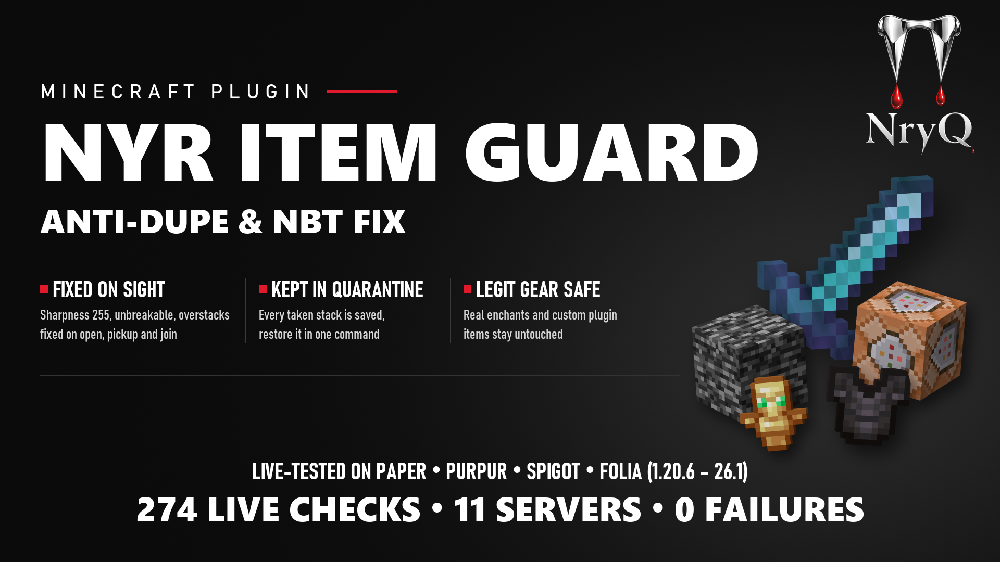
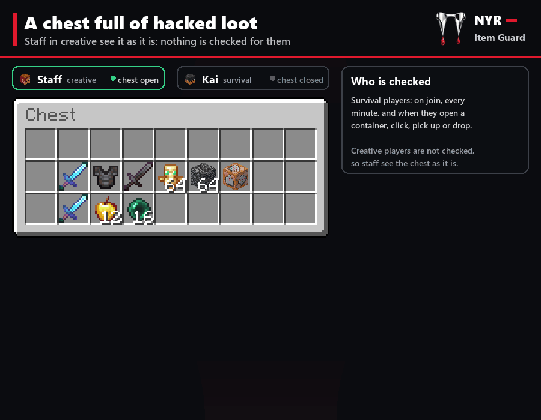

<p align="center">
  
</p>

# NYR Item Guard

A plugin for Paper, Purpur, Folia and Spigot servers. It fixes hacked, duped and admin-only items, or takes them into
quarantine, as soon as they turn up. For example:
- a Sharpness 255 sword
- an unbreakable chestplate
- a +1000 damage sword
- 64 totems in one stack
- a stack of bedrock
- a spawn egg carrying entity data

Nothing is destroyed for good. Every stack taken is kept in quarantine, and staff can give it back. Items that other
plugins made are left alone by default, so custom weapons, crate rewards and menu items keep working.

<p align="center">
  
</p>

## Compatibility

- **Java:** 21 or newer. Minecraft 26 servers need the Java version they ship for.
- **Servers:** Paper, Purpur, Folia or Spigot. The plugin declares `folia-supported: true`. No other plugin is needed.
- **Tested live on:**
  - Paper 1.20.6, 1.21.1, 1.21.3, 1.21.4, 1.21.5, 1.21.8, 1.21.11 and 26.1.2
  - Purpur 1.21.11
  - Folia 1.21.11
  - Spigot 1.21.11

  Paper 26.2 is tested only for a clean start (see [Status](#status)).

## Status

**Last updated:** 2026-10-01. Every number below comes from a run of the tests in this repository. Each claim names the
kind of run behind it.

### What works

**Unit and jar tests (MockBukkit).** With the server API jars present (see [Building](#building)), `./gradlew check`
runs 14 tests. All pass, and none are skipped:

| Module | Tests |
|---|---|
| `common` | 7 |
| `linkage` | 1 |
| `illegal` (Item Guard) | 5, plus 1 jar test |

**API linkage.** The jar makes 291 server API references. Every one was found in each of these server API jars:
Paper 1.20.6, 1.21.11, 26.1.2 and 26.2, and Spigot 1.21.11.

**Live servers, 2026-09-18.** Real servers ran with test players (mineflayer bots). Item Guard was installed together with
other NYR plugins.
- **What the tests did:**
  - a survival player opened a chest of hacked items
  - quarantine and restore
  - a hacked item dropped and picked up
  - the scan when a player joins
- **Result:** 274 checks on 11 servers.
  - 0 failed checks
  - 0 warnings or errors in the server logs
  - 0 server errors
- **Paper 26.2:** the twelfth server, which ran boot and log checks only.

**Reproducible download.** Building this source gives a byte-identical zip. It is the same zip that was built on
2026-09-18, the day of that run.

| Download | SHA-256 |
|---|---|
| `NYR-ItemGuard-1.0.0.zip` | `cf113aa716585715d8b302234f9d26d22d4be9573dfe89b52e46fafbfe24d164` |

### Known limits

- **Paper 26.2:**
  - Tested only for a clean start, a clean enable and clean logs.
  - No Minecraft client library can join a 26.2 server yet, so no gameplay was tested there.
- **Item Guard checks only the conditions listed below.** It judges each item by what the item is. It cannot tell a
  duplicated copy of a normal item from the original.
- **Two checks remove items by default:** `unobtainable` and `entity-data`. If your server hands out such items on
  purpose, hold them and run `/itemguard inspect` first, then exempt them where needed.

### To do

- **Discord invite:** the store listing text in `docs/listing/` carries a Discord invite that expires on 2026-10-15.
  Replace it with a permanent invite before then.

## Features

### What is checked

| Check | Default | What it does |
|---|---|---|
| `unobtainable` | remove | Creative-only items: bedrock, barrier, command and structure blocks, light, debug stick, end portal frame, reinforced deepslate, budding amethyst, infested blocks and more |
| `overstacked` | fix | More in one stack than the item allows: a full stack stays, and the rest goes to quarantine |
| `stack-size-component` | fix | A stack size raised above the item's own |
| `over-enchanted` | fix | Levels over the game's maximum are lowered to it (`max-levels` raises the caps) |
| `enchantment-not-for-this-item` | fix | Sharpness on a stick and the like. Books are not checked for this. |
| `conflicting-enchantments` | fix | Sharpness with Smite and the like. The higher one stays. |
| `unbreakable` | fix | The item can break again |
| `attribute-modifiers` | fix | Hand-made modifiers are replaced by the item's normal ones |
| `custom-potion-effects` | fix | Effects that no brewing stand makes are removed |
| `entity-data` | remove | Spawn eggs and other items that carry entity data |

Each check can be set to `fix`, `remove`, `report` (alert only) or `off`. Shulker boxes, bundles and other containers
carried as items are checked inside too.

### Where items are checked

- **Players:** a player's inventory and ender chest, on join and every 60 seconds.
- **Containers:** any container as it opens, and both inventories right after a click.
- **Items in the world:** items as they are picked up, and items dropped into the world.
- **Creative players:** creative-inventory actions of players who are checked.
- **Blocks:** unobtainable blocks as they are placed.

### Never touched

- **Items from other plugins:** items another plugin stored its own data on (`exempt.items-with-plugin-data`).
- **Resource-pack items:** items with a custom model from a resource pack (`exempt.items-with-custom-models`).
- **Your exemptions:** item types, names or lore you list under `exempt`.
- **Exempt players and worlds:** players with `nyritemguard.bypass`, players in creative mode (`ignore-creative-players`),
  and disabled worlds.
- **Restored stacks:** stacks that staff gave back from quarantine. They carry a mark signed with an HMAC-SHA256 key that
  only your server holds (`plugins/NYR-ItemGuard/review-key`), so a modified client cannot forge it.

### Commands and permissions

| Command | What it does |
|---|---|
| `/itemguard inspect` | Why the item in your hand is or is not illegal. Changes nothing. |
| `/itemguard scan <player>` | Check an online player's inventory and ender chest now |
| `/itemguard quarantine [page]` | The newest stacks taken, with who had them, where and why |
| `/itemguard restore <id>` | Give yourself a quarantined stack back (once) |
| `/itemguard status` | The checks, and what was fixed and removed since start |
| `/itemguard reload` | Reload `config.yml` |

The alias is `/nyritemguard`.

| Permission | What it allows | Default |
|---|---|---|
| `nyritemguard.admin` | Every `/itemguard` command | op |
| `nyritemguard.alerts` | Staff alerts when an illegal item is found | op |
| `nyritemguard.bypass` | This player's items are never checked | nobody |

### Alerts and records

Staff with `nyritemguard.alerts` are told:
- whose item changed
- what was wrong with it
- where it was
- the quarantine ids

The same line goes to the console and to `plugins/NYR-ItemGuard/alerts.log`. Each quarantined stack is stored as one
file in `plugins/NYR-ItemGuard/quarantine/`.

### Upgrading from NYR Illegal Items

NYR Item Guard is the same plugin as NYR Illegal Items, under a new name.
- **What moves automatically:** on its first start, it moves `plugins/NYR-IllegalItems` to `plugins/NYR-ItemGuard`. The
  config, quarantine, review key and alerts log carry over.
- **What you change:** grant `nyritemguard.*` wherever `nyrillegalitems.*` was granted.
- **The module keeps the old name:** the Gradle module `illegal`, the package `com.nyr.fixes.illegal` and the main class
  `IllegalItemsPlugin` keep the plugin's first name.

## Building

You need JDK 21. Gradle's toolchain support downloads it when it is missing. The first build also downloads the
dependencies from the PaperMC repository and Maven Central.

```bash
./gradlew build       # the jar, with unit tests and the jar test
./gradlew saleZips    # the download zip
```

| Output | Path |
|---|---|
| Jar | `illegal/build/libs/NYR-ItemGuard-1.0.0.jar` |
| Download | `illegal/build/distributions/NYR-ItemGuard-1.0.0.zip` |

The download holds four files:
- the jar
- the buyer's guide (source: `illegal/src/dist/README.txt`)
- the default `config.yml`
- `THIRD-PARTY-NOTICES.txt`

### The API linkage check

`apiLinkage` checks every server API call the jar makes against real server API jars.
- **Where it looks:** for the Paper and Spigot API jars under `testbed/run`. Running the test bed puts them there.
- **Jars somewhere else:** pass `-Pnyr.fixes.serverRun=<dir>`.
- **Without the jars:** the check is skipped with a warning, and `saleZips` refuses to build. A download must pass this
  check.

Every jar and zip is verified when it is built: its entries, its `plugin.yml` and its contents. The verification prints
the zip's SHA-256. The download is reproducible, so the same source always gives the same bytes.

## Live test bed

`testbed/` runs the built jar on real servers and plays the Item Guard scenario with test players. It needs Node 22 or
newer.

```bash
cd testbed
npm install
bash fetch-versions.sh 1.20.6 1.21.1 1.21.3 1.21.4 1.21.5 1.21.8 1.21.11 26.1.2 26.2
node matrix.mjs                        # every server
node matrix.mjs --only paper-1.21.11   # one server
```

**Server jars:**
- `fetch-versions.sh` downloads the Paper builds from PaperMC and checks them against PaperMC's SHA-256.
- Put the Purpur, Folia and Spigot jars in `testbed/run/downloads/` yourself, named as in `lib/servers.mjs`.

**Running servers:**
- Every test server binds `127.0.0.1` in offline mode.
- Every test server accepts the [Minecraft EULA](https://aka.ms/MinecraftEULA) for itself. Run the test bed only if you
  agree to it.

Each run writes a JSON report to `testbed/reports/` (ignored by git).

| Environment variable | Purpose |
|---|---|
| `NYR_JAVA21`, `NYR_JAVA25` | Java executables for the 1.20/1.21 servers and the 26.x servers |
| `NYR_SERVER_RUN` | Folder that holds `downloads/` with the server jars (default `testbed/run`) |
| `NYR_BOT_ERRORS` | Set to `1` to print packets the test client could not read |

The servers use ports 25611 and up.

## Store media and listing

- `media/nyr-item-guard/`: the store GIFs, the thumbnails and the cover image.
- `docs/listing/`: the BuiltByBit listing fields and the BBCode description.

## Repository layout

```text
common/      shared plugin base: config files, messages, staff alerts, commands, server platform detection
linkage/     the API linkage checker (ASM) behind apiLinkage
illegal/     NYR Item Guard: src/main, src/test (MockBukkit and the jar test), src/dist (the buyer's guide)
testbed/     live servers and the Item Guard scenario
media/       store GIFs, thumbnails and cover
docs/        store listing text
```

## License

Proprietary. All rights reserved. See [LICENSE](LICENSE). The open-source library bundled in the jar is listed in
[THIRD-PARTY-NOTICES.txt](THIRD-PARTY-NOTICES.txt).
